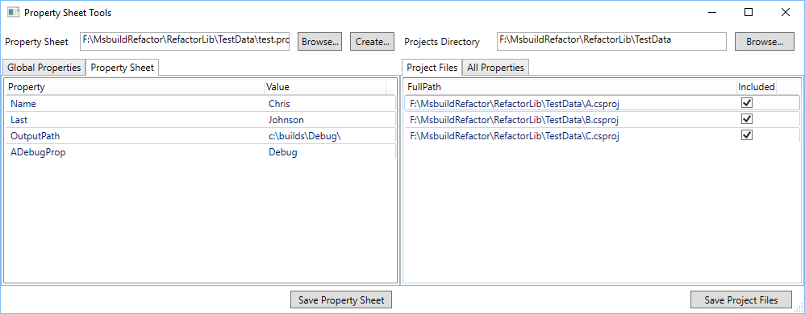

# MsbuildRefactor
A Tool to refactor many msbuild files at once

# Introduction

Refactoring an existing code base of hundreds of projects can be a made easier using this tool. Using MSBuild .NET API's it loads msbuild project files (i.e. *.csproj) displaying their build properties. A common msbuild file used to store all global properties (Which I call a property sheet) can also be loaded. Then it is up to the user to choose which build properties to move to the property sheet.
Moving properties is simply done with a drag *drag and drop*. 
The tool then takes care of 
  1. removing the property from all the project files
  2. adding the property to the common property sheet
  3. Adding an import statement to all the projects (Only when you explicitely save)

If this operation was done manually, it would be especially tedious, and fragile since usual text search/replace operations do not respect different build configurations manifest in the msbuild project files. This tool does respect build configurations thus limiting operations to specific configurations and platforms that you choose.

# How it works
Launching the app will display this window:

On the left you choose an existing poperty sheet, or create a new one. 
On the right half you choose the directory where your project files reside.
Once loaded it if you click on the *Project Files* on the right you will see the projects that were discovered in the directory and any subdirectories.

After that you can click on the *All Properties* tab to display *ALL* the properties in *ALL* the projects.

The *All Properties* tab is split into two different views:
  1. On the top is the list of all the properties in all the project files. Along with that is the count of how many project files that property was found in. 
  2. On the bottom is the details of each selected property. The details views show each of the unique that have been assigned to the property in *ALL* of the projects files. Along with that it shows how many times the property has been assigned that value.

Both windows are fully sortable on both columns. Therefore you can sort the list of all the properties by name or by count. The details view is invaluable for showing projects that have non-standard values that don't conform with the rest of the projects.

In the image above the property AssemblyName is selected. Therefore the bottom details view shows 3 different values for the property.

# What this is NOT
This tool is not a property sheet editor. You cannot edit values in the property sheet view (on the left part of the app). It is best to use a text editor for that. MSBuild has a lot of power in it's declaritive XML markup that this tool doesn't need to encapsulate.

## Drag and Drop Properties

After loading a property sheet, and selecting a directory to locate the project files.
Once that is done, select the global properties tab and select a configuration and platform you want to work with:

1. Select a property you want to move to a property sheet. The details view will update showing the different values the property was assigned in all the projects. 
2. In the details view, select the value that you want to move and drag it to the property sheet view on the left.
3. Save the property sheet (The bottom button on the left).
4. Save all the project files (The bottom button on the right).

When the project files are saved, this application will attach the property sheet by adding an 

`<Import Project="../<propertysheet_name>" />` 

element to the project files.

## Delete Properties

It is possible for a propety to take on many different values in all the project files. That is manifest in the details view on the bottom. After having dragged a property to the property sheet, is is possible for many other values to be 'left over' that you do *not* want. There is no need to drag those over as well. Instead just delete them using the `Delete` key. Delete works in both the top and bottom views on the right hand side of the application. There is no delete action in the property sheet view on the left.
